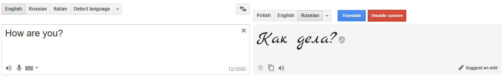

# Russian cursive for Translate Google

> gtranslate-cursive

This UserScript allows you to change font for Russian language into cursive (handwritten characters). Useful at the beginning of learning the Russian language, because handwritten and printed characters sometimes differ.

## UserScript

UserScript it's a script which use browser extenstion as interface to inject custom JavaScript into websites with some kind of extra features distributed only for browser Extensions (e.g. opening/closing tabs).

[Click to learn more about UserScripts...](https://github.com/OpenUserJs/OpenUserJS.org/wiki/Userscript-beginners-HOWTO)

## Install

There are two ways to install. Manual, in case you have to copy and paste the script yourself. Or automatic (in case you have some UserScript extension installed that allows automatic installation) - then click the link below.

[**Install**](gtranslate-cursive.user.js)
